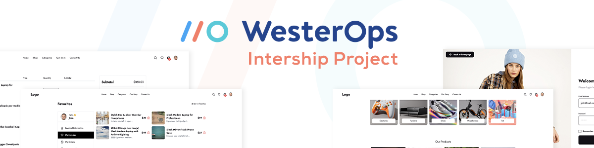
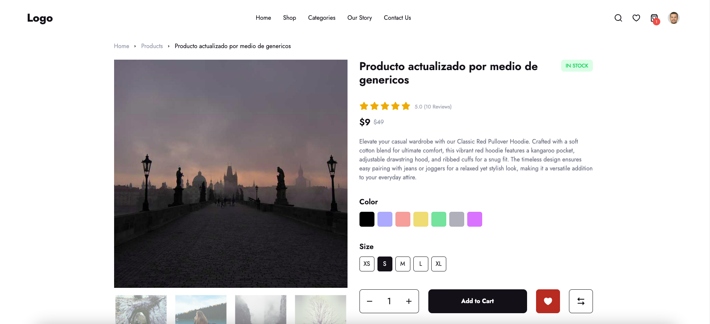
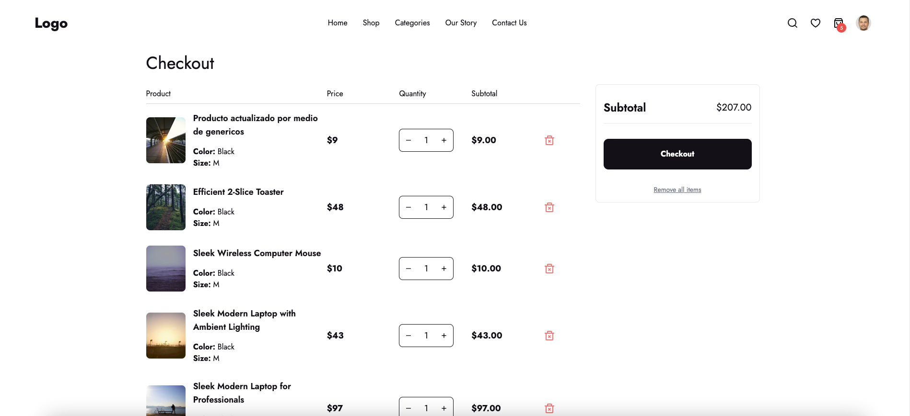
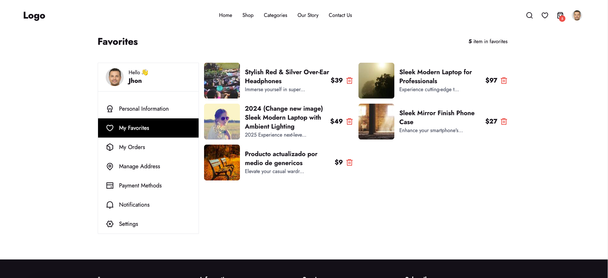

# Westerops - Intership (E-commerce)



## Table of Contents

- [Description](#description)
- [Technologies](#technologies)
- [Features](#features)
- [Screenshots](#screenshots)
- [Demo](#demo)
- [Installation](#installation)

## Description

This project is an internship project for Westerops. It is an E-commerce website that allows users to view products, add products to cart, and checkout. The website is built using React, Redux, and Tailwind CSS.

REST API: [Ecoomerce Platzi](https://fakeapi.platzi.com/en/about/introduction/)


## Technologies


## Features

- [x] Authentication
  - [x] Sign in
- [x] User Interface
  - [x] Profile Page (protected route)
  - [x] Cart Page (protected route)
  - [x] Favorites Page (protected route)
  - [x] View products
  - [x] View product details
  - [x] Search products
  - [x] Filter products by category, price, and name
- [x] User Actions
  - [x] Add, remove products from cart
  - [x] Add, remove products from favorites
  - [x] Checkout
- [x] Features
  - [x] Pagination
  - [x] Responsive design
- [x] Libraries & Tools
  - [x] Formik, Yup for form validation
  - [x] Redux for state management
  - [x] Tailwind CSS for styling
  - [x] TypeScript for type checking
  - [x] React Router for routing
  - [x] Axios for API requests
  - [x] React Icons for icons
  - [x] React Toastify for notifications


## Screenshots





## Demo

[Live Demo](#)

## Installation

1. Clone the repository
   ```sh
   git clone
    ```
2. Install dependencies
    ```sh
    npm install
    ```
3. Start the development server
    ```sh
    npm start
    ```
4. Open the browser and go to `http://localhost:3000`